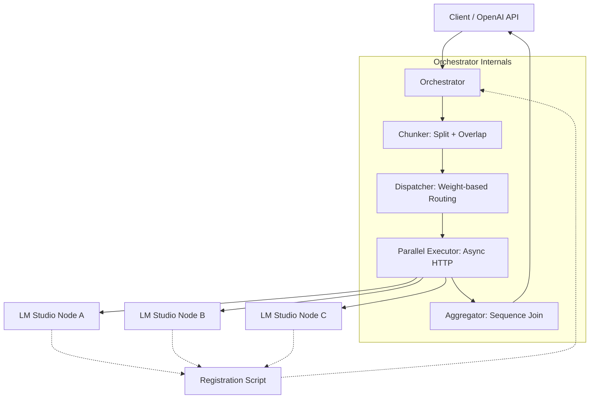

# 🚀 LM Studio Map-Reduce Orchestrator

**Accelerate long-context LLM inference on CPU-only clusters.**

The **LM Studio Map-Reduce Orchestrator** is a high-performance routing layer designed to solve the latency bottlenecks of CPU-only LLM inference. By implementing a deterministic "divide and conquer" strategy, it distributes a single large prompt across multiple LM Studio instances in parallel, drastically reducing wall-clock time for long-context processing.

## 📉 The Problem
LLM inference on CPU-only hardware suffers from high latency and low tokens-per-second (TPS). Processing a massive document on a single machine is often prohibitively slow, even if you have multiple machines available in your local network.

## 💡 The Solution
Instead of sequential processing, the Orchestrator:
1. **Maps** a long input prompt into smaller, overlapping chunks.
2. **Distributes** these chunks across a cluster of CPU-only nodes.
3. **Reduces** the partial responses back into a single, unified output.

## ✨ Key Features
- **OpenAI API Compatible**: Drops into existing workflows using the `/v1/chat/completions` endpoint.
- **Deterministic Chunking**: Uses `tiktoken` to ensure splits are based on model token limits, not character counts.
- **Context Preservation**: Implements a sliding window overlap between chunks to prevent coherence loss at boundaries.
- **Weight-Based Load Balancing**: Assigns more work to more powerful machines (e.g., a 32-core workstation vs. a 4-core laptop).
- **Asynchronous Execution**: Powered by `FastAPI` and `httpx` for non-blocking parallel requests.
- **Auto-Registration**: Lightweight registration scripts for seamless node onboarding.

## 🏗️ Architecture

## 🔄 The Map-Reduce Cycle

1. **Chunking**: The prompt is divided into $N$ segments. To maintain coherence, each chunk $i$ includes a small overlap of tokens from chunk $i-1$.
2. **Dispatching**: Chunks are assigned to available nodes based on their registered `weight`.
3. **Execution**: The orchestrator fires concurrent requests to all nodes.
4. **Aggregation**: Responses are collected, re-ordered by their original sequence ID, and concatenated into the final response.

## 🛠️ Tech Stack
- **Language**: Python 3.10+
- **Framework**: [FastAPI](https://fastapi.tiangolo.com/)
- **Async HTTP**: [httpx](https://www.python-httpx.org/)
- **Tokenization**: [tiktoken](https://github.com/openai/tiktoken)

## 🗺️ Roadmap
- [ ] **v1: Base Proxy** - Basic request forwarding.
- [ ] **v1: Endpoint Registry** - Node management API.
- [ ] **v1: Registration Script** - Automatic node onboarding.
- [ ] **v1: Deterministic Chunker** - Token-aware splitting.
- [ ] **v1: Async Dispatcher** - Parallel execution.
- [ ] **v1: Sequence Aggregator** - Ordered response joining.
- [ ] **v1: Load Balancer** - Weight-based distribution.
- [ ] **v1: Failover** - Timeout and dead-node handling.
- [ ] **v2: Performance Metrics** - Aggregate cluster TPS tracking.
